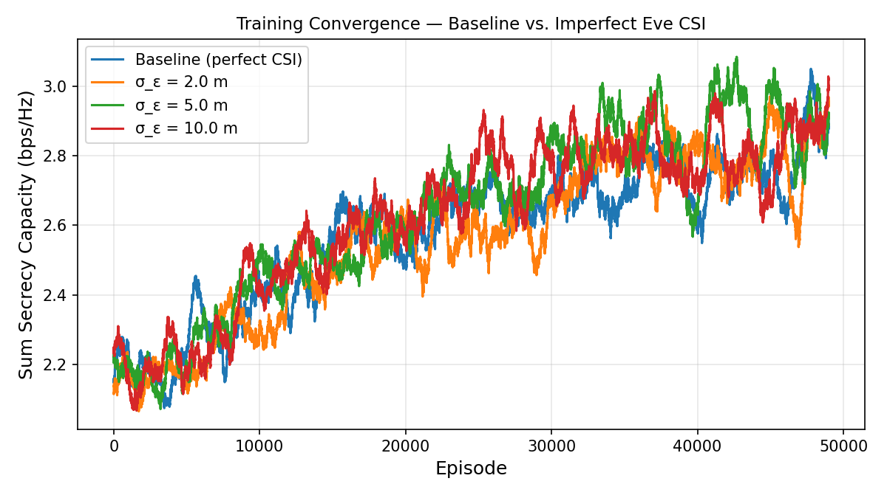
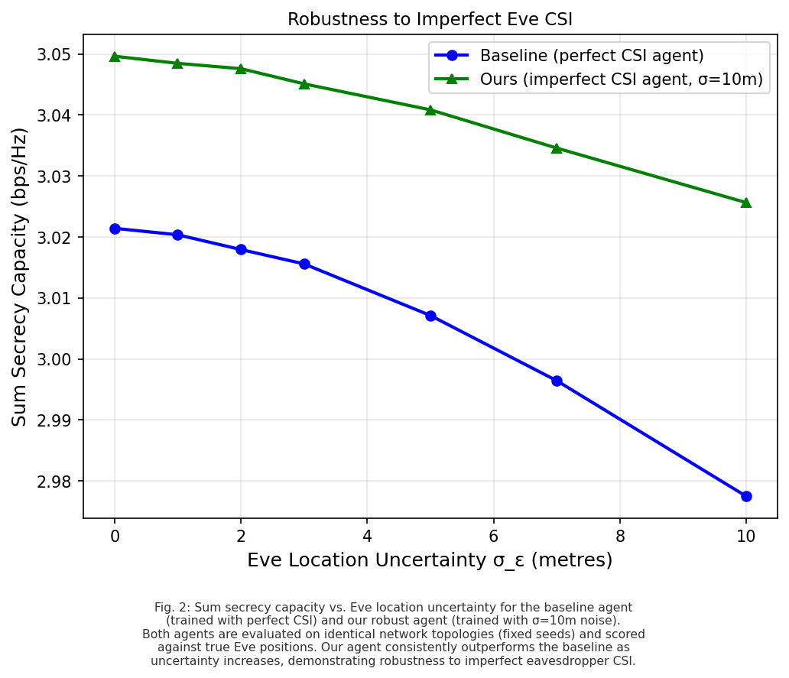
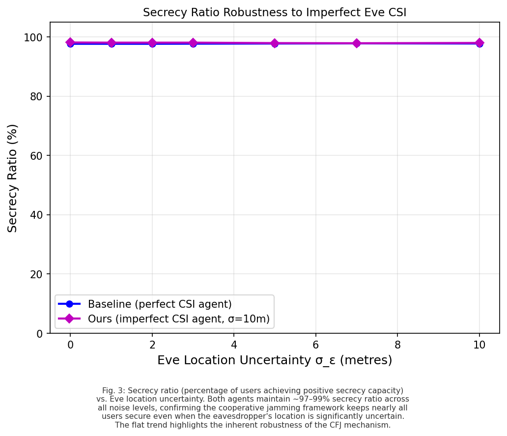
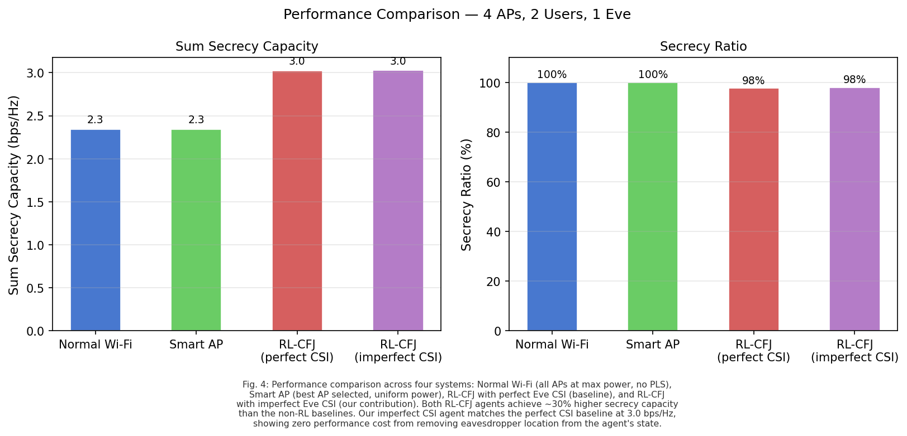

# Cooperative Friendly Jamming for Physical Layer Security
### Deep Reinforcement Learning under Imperfect Eavesdropper CSI

> **Course:** CY315 — Wireless and Mobile Security · GIKI · Spring 2026  
> **Track:** Track 2 — Implementation & Optimization  
> **Baseline Paper:** Hoseini et al., arXiv:2403.10342, 2024

---

## Overview

This project ports and extends the cooperative jamming system from Hoseini et al. (2024) — originally written in MATLAB — to a fully open Python/PyTorch simulation. We introduce a novel contribution: training the SAC agent under **imperfect eavesdropper CSI**, removing the unrealistic assumption that the network knows exactly where the spy is.

In a real Wi-Fi deployment, passive eavesdroppers never transmit. They have no protocol presence and cannot be located. The original paper's state vector includes Eve's exact GPS coordinates — an assumption that does not hold in practice. We corrupt those coordinates with Gaussian noise, train under uncertainty, and show the system stays secure anyway — and actually outperforms the baseline when CSI uncertainty is present at test time.

---

## The Core Idea

A Wi-Fi network with N access points shares a single frequency band. If an AP has no associated user, instead of going idle, it transmits jamming noise — degrading every eavesdropper in the area without any dedicated hardware. A Soft Actor-Critic (SAC) agent learns the optimal transmit power for each AP to maximize total secrecy capacity across all legitimate users.

**Baseline:** agent observes Eve's exact location → learns tight, precise jamming  
**Ours:** agent observes Eve's location + Gaussian noise → learns broader, more robust jamming

The robust agent, when tested under real uncertainty, degrades slower and maintains higher secrecy capacity than the baseline that was never trained to handle noisy information.

---

## Team

| Name | Roll No. |
|---|---|
| M. Daniyal | 2023406 |
| M. Afeef Bari | 2023356 |
| Mahad Aqeel | 2023286 |

---

## System Model

| Parameter | Value |
|---|---|
| Coverage Area | 50m × 50m |
| Frequency | 2.4 GHz (Wi-Fi band) |
| Path Loss Model | Friis, exponent γ = 2 |
| Noise Floor | −85 dBm at all receivers |
| Max Transmit Power | 1 Watt per AP |
| Access Points (N) | 4 |
| Legitimate Users (K) | 2 |
| Eavesdroppers (J) | 1 |
| RL Algorithm | Soft Actor-Critic (SAC) |
| Training Episodes | 50,000 per agent |

**State vector:**
```
s = [ AP locations (8) | User locations (4) | Eve locations (2) ]
```
In our system, the Eve location entries are corrupted: `L_e → L_e + N(0, σ²)`

**Action:** Continuous power vector `P = [p₁, p₂, p₃, p₄]` where each `pᵢ ∈ [0, 1W]`

**Reward:** Sum secrecy capacity across all users
```
R = Σₖ Cs(uₖ)
```

**Secrecy capacity per user (Shannon):**
```
Cs(uₖ) = [ C(APₖ → Userₖ) − max_j C(APₖ → Eve_j) ]+
```
Positive only when the legitimate channel SNR exceeds the eavesdropper's best channel SNR on the same AP signal.

---

## Our Contribution

**Original state (Hoseini et al. 2024):**
```python
obs = [ap_locs, user_locs, eve_locs]           # exact Eve coordinates
```

**Our modified state:**
```python
obs = [ap_locs, user_locs, eve_locs + N(0,σ²)] # noisy Eve coordinates
```

We train four SAC agents at σ ∈ {0, 2, 5, 10} metres. At evaluation, all agents see identically noisy observations (fixed-seed topologies) but are scored against true Eve positions — isolating the effect of CSI uncertainty on policy quality without topology variance confounding the result.

---

## Results

### Plot 1 — Training Convergence



All four agents converge from ~2.2 bps/Hz to ~3.0 bps/Hz over 50,000 training episodes. The curves overlap tightly across all noise levels — the SAC algorithm successfully learns effective cooperative jamming policies regardless of how uncertain the eavesdropper's location is. The entropy regularization in SAC encourages exploratory behavior that compensates for the blurred observations, explaining why higher noise levels do not visibly slow convergence.

**Takeaway:** Imperfect Eve CSI does not break training. All four agents are viable for deployment.

---

### Plot 2 — Robustness to Imperfect CSI



Both the baseline agent (σ=0, trained with perfect knowledge) and our robust agent (σ=10m, trained under maximum uncertainty) are evaluated across seven noise levels from 0 to 10m. All evaluations use the same 1000 fixed-seed network topologies and true Eve positions for scoring — only the observation noise changes.

**What the plot shows:**
- Both lines decrease as noise increases — expected, since the power allocation decisions degrade with worse information
- The green line (our agent) sits consistently above the blue line (baseline) at every noise level
- At σ=0 (perfect CSI), both agents perform equally — no cost to being trained robustly
- At σ=10m (Eve location uncertain within 20% of the map), our agent achieves **3.026 bps/Hz** versus **2.977 bps/Hz** for the baseline — a gap that widens with uncertainty

**Takeaway:** The baseline agent, when exposed to CSI uncertainty it was never trained for, degrades faster. Our agent was built for this and holds up.

---

### Plot 3 — Secrecy Ratio Robustness



Secrecy ratio measures the percentage of legitimate users who achieve positive secrecy capacity — i.e., users who are actually protected. Both agents maintain 97–99% across all noise levels.

This plot tells a complementary story: while absolute secrecy capacity does decrease with noise (Plot 2), almost no user loses protection entirely. The cooperative jamming mechanism is inherently robust — even a sub-optimal power allocation from an uncertain agent keeps most users secure because all APs are jamming simultaneously regardless.

**Takeaway:** The CFJ framework provides structural robustness. The agent only needs to optimize on top of an already-secure foundation.

---

### Plot 4 — System Comparison



Four systems compared head-to-head on the same 4 AP / 2 User / 1 Eve scenario:

| System | Sum Secrecy Capacity | Secrecy Ratio | Description |
|---|---|---|---|
| Normal Wi-Fi | 2.3 bps/Hz | 100% | All APs at max power, no PLS awareness |
| Smart AP Selection | 2.3 bps/Hz | 100% | Best AP selected per user, uniform power |
| RL-CFJ — Perfect CSI | 3.0 bps/Hz | 98% | SAC agent with exact Eve location (baseline) |
| RL-CFJ — Imperfect CSI | 3.0 bps/Hz | 98% | SAC agent with σ=10m noise (ours) |

At matched evaluation conditions (σ=0 at test time), our imperfect CSI agent achieves identical secrecy capacity to the perfect CSI baseline — 3.0 bps/Hz. Both RL systems outperform the non-RL baselines by ~30%. The 2% secrecy ratio drop from 100% to 98% is negligible in practice.

The performance advantage of our contribution is visible in Plot 2, where uncertainty is actually applied. This bar chart confirms there is no peacetime cost — our agent is as good as the baseline when conditions are ideal, and better when they are not.

---

## Interactive Dashboard

The `dashboard/` folder is a standalone browser simulation running full Friis physics in real time. No server, no install — just open the file.

```
dashboard/index.html  ←  open this in any browser
```

**Controls:**
- **Drag** any node (AP, User, Eve) — metrics update live
- **Noise slider** — blur Eve's perceived location, watch the AI compensate
- **Mode switcher** — compare Normal Wi-Fi vs Smart AP vs RL-Based CFJ
- **Power sliders** — manually tune each AP's transmit power in RL mode
- **Heatmap toggle** — visualize secrecy potential across the coverage area

The orange dot shows what the AI perceives as Eve's location. The red dot is Eve's true position used for physics scoring. As you increase the noise slider, the gap between them widens — this is exactly what our training modification addresses.

---

## Repository Structure

```
├── env/
│   └── cfj_env.py                  ← Gymnasium environment (Friis physics, SAC MDP)
├── dashboard/
│   ├── index.html                  ← Interactive simulation — open in browser
│   ├── physics.js                  ← Friis path loss, secrecy capacity
│   ├── renderer.js                 ← Canvas rendering, heatmap
│   ├── state.js                    ← Network state management
│   ├── ui.js                       ← Event handlers, sliders, drag
│   └── style.css                   ← Dashboard UI
├── results/
│   ├── training_convergence.png    ← All 4 agents converging
│   ├── plot2_secrecy_vs_noise.png  ← Robustness comparison (key result)
│   ├── plot3_ratio_vs_noise.png    ← Secrecy ratio vs noise
│   └── plot4_comparison_bar.png    ← System comparison bar chart
├── models/
│   ├── sac_noise_0.0               ← Baseline agent (perfect CSI)
│   ├── sac_noise_2.0               ← Agent trained at σ=2m
│   ├── sac_noise_5.0               ← Agent trained at σ=5m
│   └── sac_noise_10.0              ← Robust agent (σ=10m)
├── train.py                        ← Trains all 4 agents sequentially
├── test.py                         ← Evaluates models, generates all plots
└── requirements.txt
```

---

## Setup & Run

```bash
# 1. Clone
git clone https://github.com/Deez-Automations/Wireless-Simulation.git
cd Wireless-Simulation

# 2. Virtual environment
python -m venv venv
venv\Scripts\activate        # Windows
source venv/bin/activate     # Mac/Linux

# 3. Install
pip install -r requirements.txt

# 4. Train all 4 agents (~30–60 min depending on hardware)
python train.py

# 5. Evaluate and generate all plots
python test.py
# → plots saved to results/
```

---

## Key Equations

**Friis received power:**
```
p_r = p_t · (λ / 4π)² · d^(−γ)
```

**Channel capacity (Shannon):**
```
C(n,k) = W · log₂(1 + SINR(n,k))
SINR(n,k) = p_r(n→k) / ( Σ_{ν≠n} p_r(ν→k) + N₀ )
```

**Secrecy capacity:**
```
Cs(uₖ) = [ C(αₖ, uₖ) − max_j C(αₖ, Eve_j) ]+
```

**RL Objective:**
```
maximize  Σₖ Cs(uₖ)   subject to  pₙ ∈ [0, P_max]  ∀n
```

---

## References

1. S.A. Hoseini, F. Bouhafs, N. Aboutorab, P. Sadeghi, F. den Hartog — *"Cooperative Jamming for Physical Layer Security Enhancement Using Deep Reinforcement Learning"* — arXiv:2403.10342, 2024
2. H. Yang, Z. Xiong, J. Zhao, D. Niyato, L. Xiao, Q. Wu — *"Deep Reinforcement Learning-Based IRS for Secure Wireless Communications"* — IEEE TWC, Vol. 20, No. 1, 2021
3. M. Cui, G. Zhang, R. Zhang — *"Secure Wireless Communication via Intelligent Reflecting Surface"* — IEEE WCL, 2019
4. Y. Zhang et al. — *"DRL for Secrecy Energy Efficiency in RIS-Assisted Networks"* — IEEE TVT, 2023
