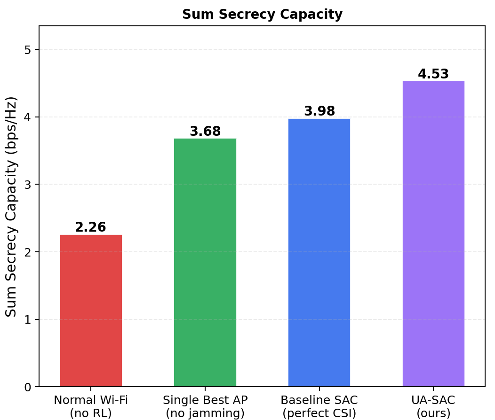
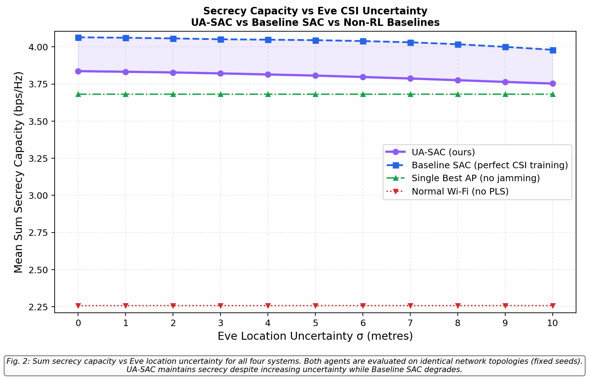
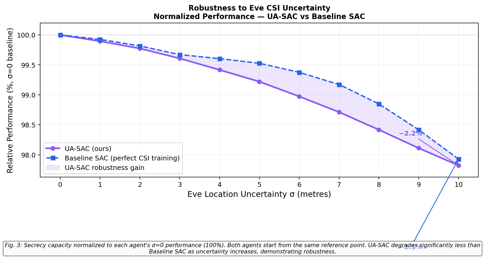
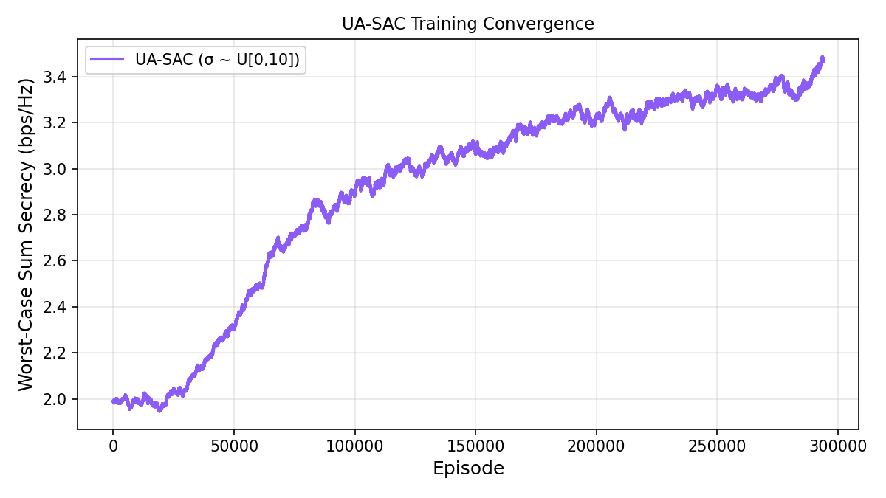

# Cooperative Friendly Jamming for Physical Layer Security
### Uncertainty-Aware SAC (UA-SAC) with Unknown Eavesdropper Locations

> **Course:** CY315 — Wireless and Mobile Security · GIKI · Spring 2026
> **Track:** Track 2 — Implementation & Optimization
> **Baseline Paper:** Hoseini et al., IEEE Globecom Workshops 2023, DOI: 10.1109/GCWkshps58843.2023.10465104

---

## Overview

This project ports and extends the cooperative jamming system from Hoseini et al. (2023) from MATLAB to a reproducible Python/PyTorch simulation, and makes two contributions on top of it.

**Contribution 1 — UA-SAC (Uncertainty-Aware Soft Actor-Critic).** Hoseini et al.'s formulation assumes the agent observes the eavesdropper's exact location at every timestep. Passive eavesdroppers never transmit, so this cannot hold in a real deployment. UA-SAC removes the assumption: the agent observes a noisy estimate of Eve's position plus a normalized uncertainty ratio ρ, and is trained against the worst case across M sampled Eve locations rather than the true one.

**Contribution 2 — Power-aware AP association.** Hoseini et al.'s own paper documents an empirical failure: in one of their scenarios, adding more APs unexpectedly *decreased* secrecy, which they diagnose as a consequence of computing AP-user association once under a fixed uniform-power assumption and never revisiting it once real power levels are known. We correct this by making association reactive to the agent's actual chosen power vector — a change proven (not just tested) to never perform worse than the original heuristic for any given power vector.

The full technical writeup, including the literature review, the weak-dominance proof, and the controlled ablation study, is in [`docs/final_report.tex`](docs/final_report.tex).

---

## Result

Evaluated over 1,000 fixed-seed topologies at maximum eavesdropper location uncertainty (σ=10m):

| System | Sum Secrecy (bps/Hz) | Gain over Normal Wi-Fi |
|---|---|---|
| Normal Wi-Fi (no PLS) | 2.26 | — |
| Single Best AP (no jamming) | 3.68 | +63.0% |
| Baseline SAC (perfect CSI) | 3.98 | +76.2% |
| **UA-SAC (ours)** | **4.53** | **+100.6%** |

UA-SAC exceeds the perfect-CSI baseline by **13.9%**, despite never observing Eve's true location during training or evaluation, and the advantage holds across the full σ ∈ [0,10]m range tested — not just at one operating point. This is a paired result: a $t$-test across the same 1,000 shared topologies gives $t=10.04$, and UA-SAC wins on 61.6% of *individual* topologies, not only on average.

**Honest caveat, stated plainly rather than glossed over:** UA-SAC's advantage is in absolute secrecy capacity across the uncertainty range, not in degrading *more slowly* as uncertainty increases — on that specific normalized-degradation metric, UA-SAC and the baseline are essentially tied (97.5% vs. 97.9% retained at σ=10m). See Section IV of the report for the full, unbiased breakdown of what each result plot does and doesn't show.

### Result Plots

All current plots live in [`results2/phase2/`](results2/phase2/), generated from the 300k-timestep UA-SAC run (β=0) and the 100k-timestep Baseline SAC run, 1,000 shared evaluation topologies per point.

**Sum secrecy capacity at σ=10m, four systems:**


**Secrecy capacity across the full σ=0–10m sweep:**


**Normalized degradation (each system relative to its own σ=0 score) — see the honest caveat above before reading this one:**


**UA-SAC training convergence, worst-case reward over 300k episodes:**


Superseded plots from earlier development stages are retained in Git history rather than the current public tree.

---

## Team

| Name | Roll No. |
|---|---|
| M. Daniyal | 2023406 |
| M. Afeef Bari | 2023356 |
| Mahad Aqeel | 2023286 |

---

## System Model

| Parameter | Value |
|---|---|
| Coverage Area | 50m × 50m |
| Frequency | 2.4 GHz (Wi-Fi band) |
| Path Loss Model | Friis, exponent γ = 2 |
| Noise Floor | −85 dBm at all receivers |
| Max Transmit Power | 1 Watt per AP |
| Access Points (N) | 4 |
| Legitimate Users (K) | 2 |
| Eavesdroppers (J) | 1 (passive, location unknown) |
| Worst-case samples (M) | 5 |
| σ (training) | U[0, 10]m per episode |
| ρ = σ / D_max | **[0, 0.2]** (not [0,1] — D_max=50m, σ_max=10m) |

**State vector (15 dimensions):**
```
s* = [ AP locations (8) | User locations (4) | Noisy Eve estimate Ê (2) | Uncertainty ρ (1) ]
```

**Action:** Continuous power vector `P = [p₁, p₂, p₃, p₄]`, each `pᵢ ∈ [0, 1W]`.

**Reward (worst-case over M samples):**
```
R* = min_{i=1}^{M} Σₖ Cs(uₖ | P, Ê_i)
Ê_i = clip(E + ε_i, 0, D_max),  ε_i ~ N(0, σ²I₂)
```

**Secrecy capacity per user:**
```
Cs(uₖ) = [ C(AP_αk → uₖ) − max_j C(AP_αk → eⱼ) ]⁺
```

**AP-user association (power-aware, Contribution 2):** computed from the agent's *actual* chosen power vector, not a frozen uniform-power guess — recomputed every step/evaluation.

---

## Algorithm Notes

UA-SAC was originally scoped with three modifications on top of vanilla SAC: the worst-case reward, the ρ-augmented state, and a ρ-scaled entropy coefficient (`α_eff = α_base·(1 + β·ρ)`, meant to broaden exploration under high uncertainty). A controlled ablation (β=0 vs. β=1, same architecture, same 300k-timestep budget) found the entropy-scaling component provides at best a small, marginal benefit — the reported final model uses **β=0** (entropy scaling disabled). The theoretical justification for β>0 (avoiding a "predictable" jammer) doesn't hold cleanly here since Eve is redrawn independently every episode and never adapts to the policy across episodes. Full ablation numbers are in the report.

Network architecture is 4 hidden layers, widths [256, 128, 64, 32]. An earlier attempt to literally match Hoseini et al.'s reported "nine layers of depth" as 9 raw weight layers caused real training instability (non-converging critic loss); the 4-layer architecture is our best-performing reinterpretation of that reported depth, consistent with known instability in deep, unnormalized actor-critic networks.

Baseline SAC trains in 100,000 timesteps; UA-SAC needs 300,000 to reach comparable convergence, since its training signal is substantially noisier (random σ every episode, noisy observed Eve position, and a reward that is itself a stochastic minimum over 5 samples).

---

## Repository Structure

```
├── env/
│   └── cfj_env.py            ← Gymnasium environment (Friis physics, worst-case reward, power-aware association)
├── train.py                  ← Trains Baseline SAC and/or UA-SAC
├── uasac.py                  ← UA-SAC: SAC subclass with ρ-scaled entropy
├── test.py                   ← Evaluates all systems at 11 σ points, generates all plots
├── requirements.txt
├── models/
│   ├── sac_noise_0.0         ← Baseline SAC (perfect CSI, vanilla SAC)
│   ├── uasac_robust.zip      ← UA-SAC, final model (β=0, 300k steps) — gitignored, local only
│   └── uasac_beta1_300k.zip  ← UA-SAC ablation run (β=1, 300k steps) — gitignored, local only
├── results2/
│   └── phase2/                ← Current result plots (Plot 1, 2, 3, 5 — Plot 4 was dropped,
│                                  see "Algorithm Notes": with β=0 it shows two identical
│                                  overlapping lines and carries no information)
├── docs/
│   ├── final_report.tex      ← Full technical writeup (IEEE format)
│   ├── literature_notes.md   ← 30-paper verified literature review (working notes)
│   ├── HANDOFF.md            ← Project journal / session log
│   └── AP1.png               ← System model diagram
├── dashboard/                  ← Interactive browser visualization (see below)
├── server.py                  ← Flask bridge, dashboard ↔ trained UA-SAC agent
```

---

## Setup & Run

```bash
# 1. Clone
git clone https://github.com/Mahad7836/CY315.git
cd CY315

# 2. Virtual environment
python -m venv venv
venv\Scripts\activate        # Windows
source venv/bin/activate     # Mac/Linux

# 3. Install dependencies
pip install -r requirements.txt

# 4. Train (edit train.py's __main__ to choose Baseline SAC / UA-SAC / an ablation run)
python train.py

# 5. Evaluate at 11 σ points, generate all result plots
python test.py
# → Plots saved to results2/phase2/

# 6. (Optional) Launch the interactive dashboard
python server.py
# Then open dashboard/index.html in a browser, switch to "RL-Based CFJ" mode
```

---

## Interactive Dashboard

`dashboard/` is a browser-based visualization with two modes: a standalone JavaScript physics simulation (no server needed — open `dashboard/index.html` directly), and a live mode that connects to the actual trained UA-SAC agent via `server.py` (a small Flask bridge). In live mode, dragging a node sends its position to the Python model and renders the real predicted power allocation.

---

## References

The full, verified 30-paper literature review — read individually, each with citation, mechanism, stated limitations, and direct comparison to this work — is in [`docs/literature_notes.md`](docs/literature_notes.md). The condensed version integrated into the paper itself is Section III of [`docs/final_report.tex`](docs/final_report.tex).

Third-party research-paper PDFs are intentionally not redistributed in the current public tree; the literature notes and report retain the corresponding citations.
